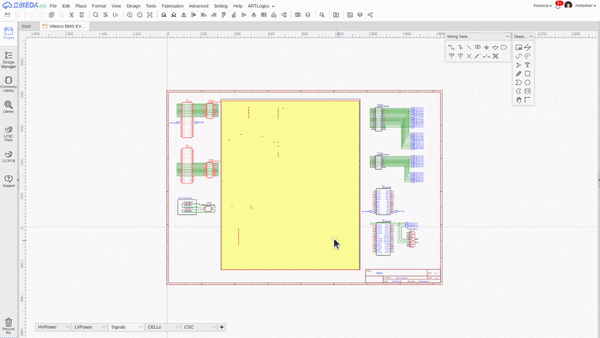

<table><tr>
<td></td>
<td></td>
</tr></table>
<h1>ARTLogics EasyEDA Extension</h1>

Helper features for ARTLogics hardware designers

## Installation

* Download [easyeda-artlogics-develop.zip](https://github.com/hotteshen/easyeda-artlogics/archive/refs/heads/develop.zip)
* Extract the downloaded archive on your hard drive
* In EasyEDA, open **Extension Settings** by using main menu `Advanced > Extensions > Extension Settings`
* Click `Load Extension` button and add all the files in the `extension` folder of the extracted source folder
* Click `Load Extension` button and close the **Extension Settings** dialog

## Generating Wiring List

**Wiring List** feature is only available in schematic editor. It is not available for PCB editor or any other kind of viewer instances.

* Open a schematics
* Select two or more connecters wired each other
* Click `ART Logics > Generate Wiring List` on the menu bar
* If the result table is good, press `Ctrl+A` and paste to document editor (MS Word or LibreOffice Writer)

## Limitations

Currently only direct connection between connectors are recognized.  
Thus, these limitations exist.

* Wires with joints: If the wire has joints and devided into multi parts, the extension does not recognize the wiring.
* Net port: if the other end of wire is a net port, the extension cannot generate wiring list between the connector and net port.

## ChangeLog

### Version 0.1

The very first version, in development.
code jkljkflda;sjfkl;asjfdkl;asfjdl